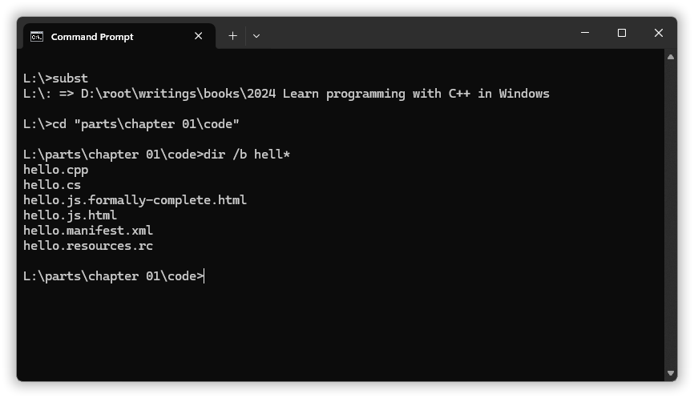
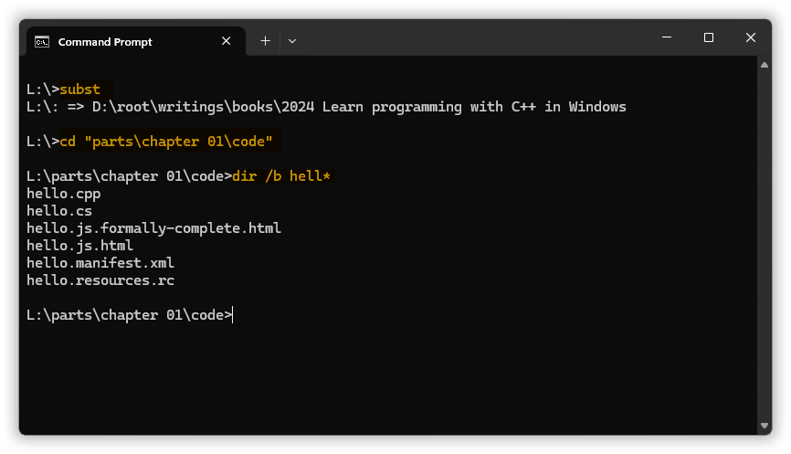
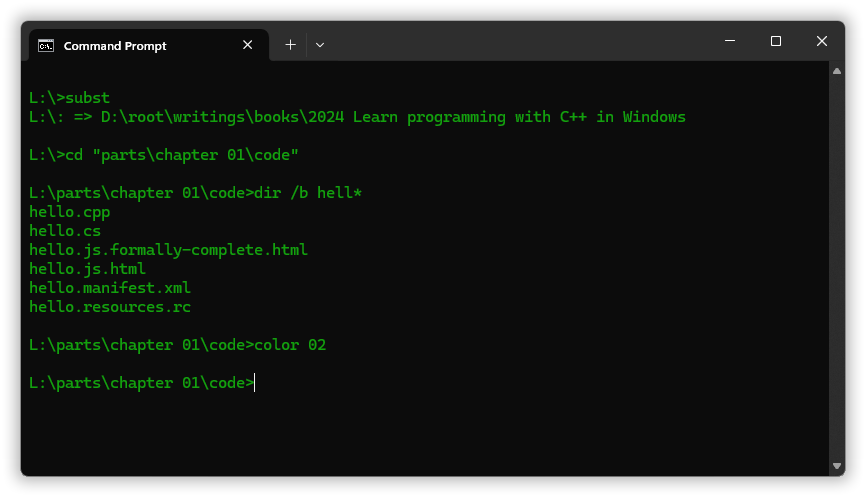
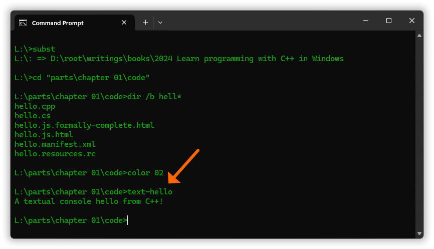

## Chapter 1: &nbsp;A gentle intro.

<!-- START doctoc generated TOC please keep comment here to allow auto update -->
<!-- DON'T EDIT THIS SECTION, INSTEAD RE-RUN doctoc TO UPDATE -->
<!-- **Table of Contents**  *generated with [DocToc](https://github.com/thlorenz/doctoc)*  -->

- [1.1 &nbsp;Execution of your code: compilation vs. interpretation.](#11-execution-of-your-code-compilation-vs-interpretation)
- [1.2 &nbsp;Seven examples.](#12-seven-examples)
  - [1.2.1 &nbsp;Example: a JavaScript message box in a browser.](#121-example-a-javascript-message-box-in-a-browser)
  - [1.2.2 &nbsp;Example: a C++ message box in the Windows desktop.](#122-example-a-c-message-box-in-the-windows-desktop)
  - [1.2.3 &nbsp;Example: a C# message box via .NET’s Windows Forms, in the Windows desktop.](#123-example-a-c-message-box-via-nets-windows-forms-in-the-windows-desktop)
  - [1.2.4 &nbsp;Example: a C# GUI window via .NET’s Windows Forms, in the Windows desktop.](#124-example-a-c-gui-window-via-nets-windows-forms-in-the-windows-desktop)
  - [1.2.5 &nbsp;Example: commands in the Cmd command interpreter.](#125-example-commands-in-the-cmd-command-interpreter)
  - [1.2.6 &nbsp;Example: C++ text output in a console.](#126-example-c-text-output-in-a-console)
  - [1.2.7 &nbsp;Example: C# text output in a console.](#127-example-c-text-output-in-a-console)
- [1.3 &nbsp;Summary & the path from here.](#13-summary--the-path-from-here)

<!-- END doctoc generated TOC please keep comment here to allow auto update -->


---

[Wikipedia](https://en.wikipedia.org/wiki/Computer_programming "Wikipedia’s “Computer programming” article"):

> ❞ **Computer programming** or **coding** is the composition of sequences of instructions, called programs, that computers can follow to perform tasks.

The first computers were used to automate manual calculations, to do these calculations faster and more reliably. The instructions in a program then just made the computer do the same as one would otherwise have done manually. But due to the speed and low cost of program execution it’s possible to program a computer to do things that are totally out of reach for a manual computation, and even things that are totally unanticipated by the programmer; fresh new stuff.


For example, a chess program or other game can usually play the game at a much higher level than the programmer, and *beat the programmer*. Not just because of the computer’s speed, but because of the smarts the program effectively has in this very narrow domain. With perfect memory it’s able to systematically explore and evaluate zillions of possible outcomes of every possible move. And for another example, in 1978  Robert W. Brooks and Peter Matelski discovered a mathematical set of points that later computer visualizations by Peter Mandelbrot showed to have an amazing infinitely zoomable self similar shape, now called the Mandelbrot set. The figure to the right, from Wikipedia (created by Wolfgang Beyer with the program Ultra Fractal 3), shows one of the “satellite” sets, which is almost identical to the full set &mdash; and there are infinitely many of them.


The instructions are usually specified as [**pure text**](https://en.wikipedia.org/wiki/Plain_text "Wikipedia’s “Plain text” article"). Environments where one can specify the instructions by positioning graphical symbols and boxes, [do exist](https://en.wikipedia.org/wiki/Visual_programming_language "Wikipedia’s “Visual programming language” article"), but are mainly designed for children. General programming is most often only text, so the physical aspect of programming is mainly to write and edit text.

Of course there’s a lot of thinking also. And trying out things. And so on.

Which instructions you can use depend on a lot. The computer’s built in instructions are almost never used directly because each one does so exceedingly little. Instead we use instructions that are *defined in terms of* sequences of other instructions, that in turn are defined in terms of, that are defined in terms of…, and so on, which at some point ends up in instructions that finally are defined directly in terms of the computer’s built in binary instructions. So there is no universal set of instructions to use for a given computer. There are the instructions that have been defined by your programming environment, and by yourself.

A **programming language** is a set of rules for how to define new instructions (you’ll do that all the time!), and how to use instructions: what you can and must write to use them. You need to select a programming language and write **code** &mdash; the sequence of instructions &mdash; according to the rules of that language. And you will need to use tools that support that language.

So

* the instructions you can use and how they look, depends on which programming language you’re using; and
* they depend on which instruction definitions you have made available; and
* while some of the instructions you use map more or less directly to just a handful of built in computer instructions, i.e. result in the execution of at most a handful of built in instructions, some of the instructions that you use map to at least 263 zillion built in instructions (this is just a Very Big Number&trade;).

A modern computer executes its built in instructions at breakneck speed. The old PC that I’m writing this on has 6 CPU “cores” that each executes one instruction sequence. Each does 2.4 billion *steps* (clock ticks) per second. Now, some instructions may take more than one step, but on the other hand in some cases several instructions may effectively be executed, in parallel, in a step. So if you use a high level instruction, and let’s say it requires and waits for the user to type in something, and if that takes 7 seconds, then on this PC the 263 zillion built in instructions could be 16.8 billion. Or whatever, these are huge, gargantuan numbers, which tells you that

* each built in instruction *really* does very very little, and
* the computer necessarily repeats executing some parts of the instruction sequence,

&hellip; for otherwise it would run out of instructions to execute in just a few seconds.


### 1.1 &nbsp;Execution of your code: compilation vs. interpretation.

To write the instructions of a program (or just, to write a program) you can use almost any text editor including Windows’ own Notepad. However it’s much easier if the editor supports coding in general and your chosen programming language in particular. For example, a **programmer’s editor** such as Notepad++ or VS Code or the editor in Visual Studio can help you automatically indent new code lines systematically, which is very important in order to readily see the structure of the code; it can use automatic coloring to clarify what rôles different parts of the code play; it can auto-complete words that you start typing; and so on:


The above screenshot shows the Notepad++ editor as it’s used to create the examples of this chapter, i.e. writing the textual code.

But how do you get your code executed?

* *Compilation:*  
  One way is to use tools to automatically create a new executable program, usually one with binary instructions that the computer can execute directly, that *corresponds to your textual instructions*. The translation from your written instructions to computer built-in instructions is called a **compilation** of the program text. You can then have this corresponding executable file executed, any number of times, or e.g. send it to a friend.
  
  With compilation there are two instruction sequences that (ideally, when everything’s 100%) mean the same; they’re both “code” for the program. The program text you wrote is **source code**. The corresponding generated executable usually contains **machine code**, that is, directly executable computer-specific built in instructions.

  To create the executable you mainly need a **compiler** for the programming language that you’ve used, but often also some other tools, e.g. to add data to the executable, and/or to automate the operations involved in this. Alas, Windows only provides compilers for Microsoft’s own languages for the .NET platform, namely C#, JScript.NET and VBScript.NET, and on my Windows 11 the compilers bundled with Windows are old versions. And so for other languages &mdash; including the C++ language used in this book &mdash; as well as for the most recent versions of the Microsoft languages, in order to create an executable you need to download and install the requisite tools.

* *Interpretation:*  
  An alternative to creating a new executable program is to get an existing one, such as your web browser, to let itself *be directed* by your textual instructions. I.e. your textual instructions are then instructions for that program, telling it what to do, with that program more or less directly “executing” your instructions. This is called **interpretation**, and the program or program part doing the interpreting, being directed, is called an **interpreter**.
  
  In ordinary everyday language an interpreter translates from one spoken language to another, but in programming an interpreter “translates” from instructions to actions, effects.

  All web browsers have a built in JavaScript interpreter.

Modern interpreters often do some compilation on the inside, to translate the program text to a form that’s more efficiently interpreted. This means that you can get *compilation errors* from an interpreter. But when everything works you don’t see any sign or hint of any compiler and it’s as if the interpreter is directed directly by the text.


### 1.2 &nbsp;Seven examples.

The three first examples below show how to present a simple textual message in a box, a *message box*, with (in order) JavaScript in a browser, C++ using the core Windows functionality, and C# using Windows Forms in .NET in Windows.

An example of a general window with auto-wrapped text, using C# and Windows Forms, is then presented. This illustrates that general window (GUI) stuff, as opposed to message boxes, is complex and involves much code. On a first reading you’re only expected to get a general impression of what such code is like, but with the take-away: GUI is complex.

The three last examples then illustrate the pure text environments known as *console windows*, which are much used, they’re almost indispensable!, in programming work. First there’s one example of using a general command interpreter in a console window (most/all general command interpreters run in console windows). Then come two minimal examples of programs to present a single line of text in a console, in C++ and in C#, and this &mdash; presenting text in a console &mdash; is the basis of the majority of beginner’s programs.

These examples mainly show how code looks and how different environments and programming languages are, well, different.

For this purpose all the examples here have the same high level goal: they all just present some given text. But they do it in different ways and in different environments. And that allows you to see the differences in how the common abstract goal is expressed; it makes the examples comparable, which is good. On the other hand it largely fails to show how a program can do much more than you put into it, how it can be much more than a simple replay of actions, such as displaying a surprising Mandelbrot set. This is covered later in the book.


#### 1.2.1 &nbsp;Example: a JavaScript message box in a browser.

Every web browser makes available a JavaScript instruction called `alert`, that pops up a **message box**. Using that instruction to display a message box with the text “Hello from JavaScript!” can go like this:

```js
alert( 'Hello from JavaScript!' );
```

So this is an example of the look & feel of **JavaScript** code.

Result with the Chrome browser when that JavaScript code is fed to it via the “.html” file shown below:


You *can* feed JavaScript code *directly* to your browser by e.g. typing `javascript:alert('Hello from JavaScript!')` in its address bar. But the direct methods get impractical or downright impossible with larger code snippets, not to mention with a full JavaScript program that does something useful. So then instead, more indirectly, the browser is fed a text file, e.g. an `.html` text file (`.html` is one of the filename extensions that a browser knows about), and in that text file the browser requires that the JavaScript code is placed within or referred to from some **HTML** code, which has an entirely different look & feel with lots of angle brackets:

[*hello.js.html*](code/hello.js.html)

```html
<script>
    alert( 'Hello from JavaScript!' );
</script>
```

Note: by the formal rules of HTML this isn’t complete code &mdash; [many more lines of HTML](code/hello.js.formally-complete.html) would have to be added for that &mdash; but all browsers accept this short form.

HTML is not a programming language, because one can’t specify *actions*. It’s the **formal language** used to specify the *contents*, primarily text and images, of a web page. E.g. if you add some text at the top of the above file, that text will be displayed in the browser, but possibly all or partly behind the message box &mdash; until you dismiss the box by clicking OK.

A programming language is also a formal language, but with action capability. HTML is just passive specification of content, except that it can contain e.g. JavaScript snippets that do have action capability. A web browser is essentially a viewer for HTML files, namely the web pages that it usually fetches from the net.

This local HTML file can be fed to the browser in a number of ways, including

* just double-clicking it; or
* using the `start` command in Windows’ Cmd or PowerShell, e.g. `start hello.js.html`; or
* opening the file from within the browser, e.g. the keyboard shortcut `Ctrl`+`O` for “open” probably works.

You can try this out by copying the code exactly to a local “.html” text file. It’s possible to fail because there are *lots* of things that can go wrong, and there’s Murphy’s law “anything that can go wrong will go wrong”. If that happens then try to figure out what went wrong and fix it, and remember that you can get help from others in forums e.g. on Reddit, and that googling the problem can help.


#### 1.2.2 &nbsp;Example: a C++ message box in the Windows desktop.

A main programming language in this book is **C++**, and unlike JavaScript it’s not supported by web browsers.

C++ generally requires you to create an executable file from your program text, and as mentioned, Windows does not provide the tools for that. So on a first reading you probably don’t have such tools and will not be able to try out the following. But this example lets you see some of what C++ is about, that Windows’ core functionality is readily available to C++ programs, and among other things Windows makes available a C++ instruction called `MessageBox` that presents a message box.

The Windows message box has a lot more options than JavaScript-in-a-browser `alert`. You can choose an icon (four different) or no icon, you can choose a predefined set of buttons (the default is just an “OK” button), and after the user clicks away the box you can inspect which button he or she used, which is especially useful for asking simple questions. To be fair, the most common usage of the button sets beyond the default OK button, is a box with a simple yes/no question and ditto buttons, either “Yes” and “No” or else “OK” and “Cancel”, and JavaScript-in-a-browser supports the latter pair via an instruction called `confirm`.

Anyway C++ use of Windows’ `MessageBox` instruction can go like this:

```cpp
    MessageBox( 0, "Hello from C++!", "C++ says:", MB_ICONINFORMATION | MB_SETFOREGROUND );
```

In both JavaScript and C++ (and C# that we will soon encounter) code can generally be split up into multiple lines as long as one doesn’t split a name or number or other “token”, and one may do that e.g. in order to add `//` explanatory **comments**:

```cpp
MessageBox(
    0,                                      // Parent window - none.
    "Hello from C++!",                      // Message text.
    "C++ says:",                            // Box title.
    MB_ICONINFORMATION | MB_SETFOREGROUND   // Icon, button set, options.
    );
```

Comment text is ignored by a compiler. Comments are meant only for a human reader, so they serve the most important purpose of code: to communicate to a human reader. Different languages have different ways of writing comments, but JavaScript, C++ and C# have many very similar or identical rules, including the use of `//` to start a comment.

As with JavaScript-in-a-browser some more text is required around this C++ instruction, to satisfy the tools used to get the code executed. But here it will all be C++. The `#include` below is a C++ way to drag in Windows’ *declaration* of the `MessageBox` function so that the C++ compiler will know that that instruction exists; the `main` is a requirement of C++ (it can be expressed in various ways); and ditto the curly braces, they’re just a C++ requirement, they must be there:

[*hello.cpp*](chapter%2001/code/hello.cpp)
```cpp
#include <windows.h>

auto main() -> int
{
    MessageBox(
        0,                                      // Parent window - none.
        "Hello from C++!",                      // Message text.
        "C++ says:",                            // Box title.
        MB_ICONINFORMATION | MB_SETFOREGROUND   // Icon, button set, options.
        );
}
```

After using the C++ tools in the most straightforward way to create an executable file, **running** it (having it executed), e.g. by double-clicking it, produces


It’s not *perfect*, e.g. the button has an archaic square and all gray look. Unfortunately Microsoft chose to let `MessageBox` and other GUI elements use an old archaic style by default, and made it non-trivial to get [the modern style](https://learn.microsoft.com/en-us/windows/win32/controls/cookbook-overview#using-comctl32dll-version-6-in-an-application-that-uses-only-standard-extensions "Microsoft documentation: “Enabling Visual Styles”"). We’ll do that later, but for now, the very same C++ code, but just by adding some special data to the executable, can produce a message box like this:


As of mid 2024 it’s *possible* to create a message box like the first one via JavaScript, because Microsoft still hasn’t entirely removed some old JavaScript technology in Windows, part of what was known as the Windows Script Host or WSH for short. But let’s not delve on the past. Let’s move on.


#### 1.2.3 &nbsp;Example: a C# message box via .NET’s Windows Forms, in the Windows desktop.

A large part of Windows’ functionality is not directly accessible to standard C++ code because it’s part of [**.NET**](https://en.wikipedia.org/wiki/.NET "Wikipedia’s “.NET” article"), a set of instruction definitions (and other stuff) that builds on the core Windows functionality but that unlike the core Windows functionality

* isn’t designed for the C and C++ languages.

.NET has been part of Windows since Windows Vista. Standard C++ and .NET are a bit at odds not just because of the technical details but also because .NET is a “safe” **managed environment** where a program can’t just do whatever it wants, in particular with respect to memory management. In contrast much of the point of C++ is to be able to do anything, including full control over the use of memory.

So with .NET one primarily uses languages designed for .NET, or that .NET was designed to accommodate, such as Microsoft’s **C#**.

.NET has several frameworks for creating and handling general desktop windows, including *Windows Forms*, *Windows Presentation Foundation* and *WinUI 3*. To avoid having to use Microsoft’s Visual Studio for code generation &mdash; and presenting all the resulting mess &mdash; I’ll here use the oldest of the three, Windows Forms. A modern C# message box program using Windows Forms can go like this:

[*hello.cs*](chapter%2001/code/hello.cs):

```csharp
using System.Windows.Forms;

Application.EnableVisualStyles();       // Modern look ’n feel, please.
MessageBox.Show(
    "Hello from C#!",                       // Message text.
    "C# says:",                             // Box title.
    MessageBoxButtons.OK,                   // Button set.
    MessageBoxIcon.Information              // Icon.
    ); 
```

With the C# language version 8 and earlier some more text needs to be added around the instructions, just as with JavaScript and C++, but [version 9 removed this requirement](https://www.educative.io/answers/what-are-top-level-statements-in-c-sharp-90). The version I’m using for this book is 12, supplied by installation of Visual Studio. To find that version number I compiled a source file containing only the line [`#error version`](https://learn.microsoft.com/en-us/dotnet/csharp/language-reference/preprocessor-directives#error-and-warning-information), which with Microsoft’s compiler causes the error message to include language version information (yes, that’s a weird roundabout mechanism, but it works).

Anyway, *without* the `Application.EnableVisualStyles();` instruction the result is the same as the first C++ result, except for the text:


And *with* the `Application.EnableVisualStyles();` instruction, as in the code shown above, the result is the same as the second C++ result, the one where the modern look ’n feel was obtained by adding some special data to the executable:


So,  different languages can have slightly different ways to achieve the same, here added data (C++) versus added instruction (C#), to get the modern look. But the code to produce the message box is pretty much the same in the C++ and C# code, and the final results are identical except for the text. That’s because the C++ code directly uses Windows’ core functionality for presenting a message box, and the C# code uses that functionality indirectly by asking Windows Forms to produce a message box, and Windows Forms does that by using the same Windows’ core functionality.


#### 1.2.4 &nbsp;Example: a C# GUI window via .NET’s Windows Forms, in the Windows desktop.

A message box is a special purpose window where you only can vary a few things. With a general window you can include anything, or nothing, in the window. Using Windows’ core functionality directly for that is too complex to be of value as an example here, but it can be beneficial to have seen general window code expressed in C#, using Windows Forms.

As mentioned this example illustrates that general window (GUI) stuff, as opposed to message boxes, is complex and involves much code. On a first reading you’re only expected to get a general impression of what such code is like. Many parts of the code can make some sense even if you’ve never seen anything like this before, but the main intended take-away is just that:

&hellip; GUI is complex.


```csharp
using System.Windows.Forms;             // Form, Label
using System.Drawing;                   // Point, Size, Font, FontStyle, GraphicsUnit
    
Application.EnableVisualStyles();       // Modern look ’n feel, please.

var window = new Form();
window.Text             = "C# says:";       // `Text` is the window title.
window.ClientSize       = new Size( 512, 256 );
window.FormBorderStyle  = FormBorderStyle.Sizable;

var rows = new System.Windows.Forms.TableLayoutPanel();
rows.Dock               = DockStyle.Fill;
rows.RowStyles.Add( new RowStyle( SizeType.Percent, 100 ) );
rows.RowStyles.Add( new RowStyle( SizeType.Absolute, 40 ) );
window.Controls.Add( rows );

var upper_panel = new System.Windows.Forms.FlowLayoutPanel();
upper_panel.Dock        = DockStyle.Fill;
upper_panel.BackColor   = Color.White;
rows.Controls.Add( upper_panel, 0, 0 );

var text_display = new Label();
text_display.AutoSize   = true;
text_display.Text       = "A GUI window hello from C#!";
text_display.Font       = new Font(
    "Book Antiqua", 48, FontStyle.Italic | FontStyle.Bold, GraphicsUnit.Pixel
    );
text_display.ForeColor  = Color.Green;
upper_panel.Controls.Add( text_display );

var ok_button = new Button();
ok_button.Anchor        = AnchorStyles.Right | AnchorStyles.Bottom;
ok_button.Text          = "OK";
ok_button.Click         += (object o, System.EventArgs ea) => { window.Close(); };
rows.Controls.Add( ok_button, 0, 1 );

Application.Run( window );
```

Phew! That escalated fast, as they say. Which shows that GUI code can be fairly non-trivial, complex, and verbose.

On the positive side it exemplifies the notion of a *sequence* of instructions, not just one or two.

Result:


If you drag e.g. the lower right corner of the window to make it wide enough, the text is then presented on one line. And conversely, if you make the window thin enough the text is presented with one word per line. All while the button moves to position itself nicely in the lower right corner so it looks like it’s fastened there, within the gray field that is always at the bottom.

All this automatic resizing and moving of elements is functionality that Windows Forms adds *on top of* the basic Windows functionality.


#### 1.2.5 &nbsp;Example: commands in the Cmd command interpreter.

If you now have the impression that programming involves dealing with *text* and dealing with *files*, and that it involves using special *tools*, you’re right.

We do much of this work in a purely textual environment called a **command interpreter**. As that term implies a command interpreter interprets and executes the commands that you type in. You type in a textual command; the command interpreter executes it, which may move some files or run a program or just produce some text as result, whatever; you type in a new command; etc., command → effect → command → effect → command → effect…, which is a simple procedure.

But while it’s usually clear in one’s head while one is doing it, it can look pretty cryptic:



Windows ships with two general command interpreters called **Cmd** and **Powershell**. In addition a programmer working in Windows is very likely to enable the Windows Subsystem for Linux, or WSL for short, and then do at least some of the work in a Linux general command interpreter called **bash**. The above example uses Cmd, which is the original Windows command interpreter and which is the one that’s invoked by the C++ `system` instruction and by corresponding instructions in other programming languages.

When you haven’t seen a programmer’s command interpreter before it can be difficult to see what parts of that text are commands typed in by the user, and what parts are responses from the command interpreter and/or the programs run by the commands.

So below I’ve *recolored* the text, with typed in commands in orange. Unfortunately AFAIK no modern command interpreter does that automatically, or even supports doing it. So this is a very manually created clarification of the screenshot:



So here the user typed in three commands: a `subst` command, a `cd` command, and a `dir` command. The `subst` command was used to check which folder the `L:` drive letter (a *logical drive*) was mapped to; the `cd` command was used to *change directory*, which means to go (here down in-) to another folder; and the `dir` command was used to list the file names that matched a specified pattern “`hell*`”, where the `*` is a *wildcard*. Some of this, the delving into a folder and the listing of file name matches, can also be done via mousing in Windows Explorer, but Windows Explorer lacks functionality corresponding to the `subst` command, that is, it lacks support for local logical drives.

Since the command coloring helps tremendously for at least some folks, including for myself, I would really have liked to apply command coloring to examples further in the book. However, Github, where this document resides, doesn’t support that (their excuse that colors would be a security risk doesn’t quite ring true for me). So instead I will use some awkward trickery to present commands &mdash; and general user input in a console &mdash; in the style of ***`subst`***, ***`cd`*** and ***`dir`***. But keep in mind that on the screen commands are not visually distinct; the coloring or special font variation is a cosmeticized view of reality, like an Instagram photo filter.

While most and possibly all command interpreters lack support for a distinct color for user input, they &mdash; or rather the **console windows** they run in &mdash; do let you choose the overall color of the text. I usually set console windows to green text on black or dark blue text on white. And it so happens that Cmd has a built-in command called `color` that lets you choose the general text and background color for the particular console window you’re working in:



So, commands can do all sorts of things. They’re much more powerful than using the mouse. Not the least because you can automate things by storing a sequence of commands in a text file and from then on use that as a new command (sounds familiar, yes? &mdash; it *is* a kind of programming, with commands).


#### 1.2.6 &nbsp;Example: C++ text output in a console.

Many commands, including the `subst` command used above, are simply programs created with C++ or old C. Or perhaps some other programming language but C++ and C are the most common for this. Here’s a simple console-oriented C++ hello program:

[*text-hello.cpp*](chapter%2001/code/text-hello.cpp)
```cpp
#include <stdio.h>

auto main() -> int
{
    puts( "A textual console hello from C++!" );
}
```

Here the `#include` drags in a declaration of the console-oriented `puts` instruction, informing the C++ tools that that instruction does exist.

After using the requisite tools to create a corresponding executable file “text-hello.exe” (not shown here), the base name of that executable file, “text-hello”, can be used as a command to run it:



The text produced in the console is called the program’s **output**, here “A textual console hello from C++!”. Correspondingly, if the program asks the user to type in something, that’s **input** to the program. But note: these terms  *can* be used in a more general sense for they do not strongly imply that output necessarily goes to the console, or that input comes from the user typing away on a keyboard, or even that it’s about text. They refer more to the direction of the data flow, out of the program or into the program. So a program may take input from a file, and produce output in another file, and that’s, for example, what a compiler does.

So a new command `text-hello` was created, producing the text “A textual console hello from C++!” as its output, and that command was created in a way that is very simple when one just has the tools installed and some experience with using them.

E.g. with Microsoft’s tools, properly configured, I can use the command `cl text-hello.cpp`, or with the MinGW tools I can use the slightly more elaborate command `g++ text-hello.cpp -o text-hello`. And due to the command interpreter’s support for working this way I don’t even have to type the full `text-hello.cpp` filename. I can just type `t` and press the `Tab` key and it will **auto-complete** the filename (auto-completion is usually also available in a programmers’ editor, for writing the code).

And commonly at the start of learning programming one creates only such **console programs**, purely text oriented programs that need to be run from a command interpreter &mdash; or technically in any console window, but in practice from a command interpreter &mdash; as opposed to **GUI programs** with general windows, that are launched via menus or double-clicking or the like. One chooses to do console programs because they’re much easier to program: they’re *very* much easier to program. One can concentrate on learning & investigating various important stuff rather than struggling forever with just GUI presentation aspects.

So, there will be *a lot* of console oriented examples, and to save both space and work and your reading effort I will from here on usually just present *the relevant text in the console windows*, and not screenshots of the windows, e.g. like

<pre>
L:\><b><i>subst</i></b>
L:\: => D:\root\writings\books\2024 Learn programming with C++ in Windows

L:\><b><i>cd "parts\chapter 01\code"</i></b>

L:\parts\chapter 01\code><b><i>dir /b hell*</i></b>
hello.cpp
hello.cs
hello.js.formally-complete.html
hello.js.html
hello.manifest.xml
hello.resources.rc

L:\parts\chapter 01\code><b><i>color 02</i></b>

L:\parts\chapter 01\code><b><i>text-hello</i></b>
A textual console hello from C++!

L:\parts\chapter 01\code>|
</pre>

It’s not perfect: the orange coloring shown in the screenshot earlier, was much more clear. But on Github this is probably the best possible where you can copy the commands text, and it’s ~good enough. It will do.


#### 1.2.7 &nbsp;Example: C# text output in a console.

A C# console program roughly equivalent to the C++ one can go like this:

```csharp
using System;       // Console
Console.WriteLine( "A textual console hello from C#!" );
```

Output after compiling, i.e. after generating a corresponding executable (not shown here):

<pre>
L:\parts\chapter 01\code><b><i>text-hello</i></b>
A textual console hello from C#!
</pre>

Creating such console programs can be a very practical way to learn programming, and is the usual way to learn programming, because one avoids all the extra presentation- and interaction-related stuff and complexity of a GUI program.

Console programs can also be very useful as tools for programming work. In fact most tool that we’ll use, including the `csc` C# compiler that I used to compile this program, and including the mentioned `cl` and `g++` C++ compilers, are console programs. And it happens that one creates small tools for personal use, as console programs. As my late father sometimes said, if you don’t have a tool you need, you make it. That was about wood work, but it applies just as much in programming.

In addition console output from a GUI program while one is *creating* it, can be useful, because it lets you see what’s going on on the inside.


### 1.3 &nbsp;Summary & the path from here.

asd asd
