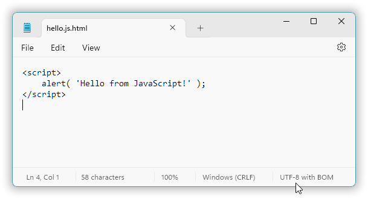
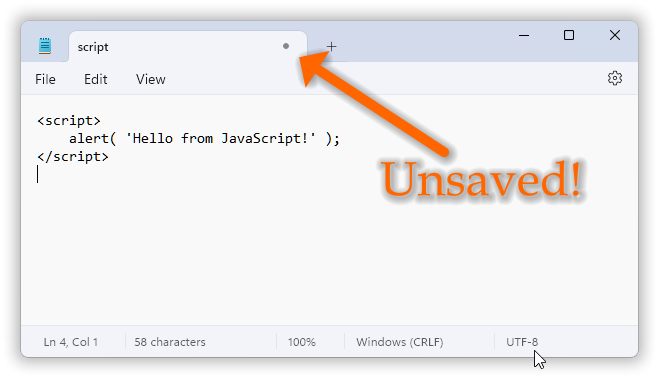

## Chapter 2: &nbsp;First steps.

<!-- START doctoc generated TOC please keep comment here to allow auto update -->
<!-- DON'T EDIT THIS SECTION, INSTEAD RE-RUN doctoc TO UPDATE -->
<!-- **Table of Contents**  *generated with [DocToc](https://github.com/thlorenz/doctoc)* -->

- [2.1 &nbsp;“Hello, world!”.](#21-hello-world)

<!-- END doctoc generated TOC please keep comment here to allow auto update -->

---

The only good way to learn programming is by **doing**: trying out stuff, investigating, exploring, experimenting, making sure that one actually can do the things. And just implementing one’s own ideas, maybe wild ideas. I like that last part best.

Here at the start you get detailed guidance on how to *do* things. We’ll start by trying out the JavaScript hello-example from the first chapter, even if you’ve already done that on your own. Some variations follow.

But later on there will be progressively less and then no detailed how-to guidance for the *do*-ing. You are then expected to figure out things, because the most important and effective tool you have is **you**, your brain. And that includes both sides of that brain: both the right brain’s sense of aesthetic beauty, e.g. designing the perfect user interface, and the left brain’s analytical part that figures out how to make that design work so that it’s not just pretty cosmetics but actually a super-useful thing.

For example, at some point you may wonder, where to click or what to write in a command? That’s for you. You will **look** at what’s available to you and recognize it and just apply what you’ve already learned and use resources such as command help-texts, documentation (on the net and local), plain googling,

<table width="100%" border="0">
<tr>
<td width="180"></td>
<td valign="top">

&larr; asking people in programming  forums, and

<p>&nbsp;</p>

in some cases you’ll obstinately do hard
detective work into the very late hours&hellip; &rarr;
</td>
<td width="180"></td>
</tr>
</table>

<table width="100%" border="0"><td>


Good googling skills are important for programming. You will need to be able to sort out the wheat from the chaff in the search results. Because while artificial intelligence can help and does have a lot of knowledge, as of 2024 it still lacks common sense. And so there will be a lot of irrelevant results and a lot of low quality results, for you to sort out. You will need to be able to mostly ignore the irrelevant and the low quality, at a glance, and possibly follow vague clues for several levels of links, and dive right into the good helpful links. This ability comes with experience. By doing this many times.
</td></table>

### 2.1 &nbsp;“Hello, world!”.

In the first chapter you saw how JavaScript code can be “packaged” within HTML that can be fed to a web browser:

[*hello.js.html*](code/hello.js.html)

```html
<script>
    alert( 'Hello from JavaScript!' );
</script>
```

And I mentioned that to write source code like this you *can* use almost any text editor including Windows’ own Notepad.

In Windows 11 Notepad it looks like this:




Shortly you will need a better source code editor, a programmer’s editor like Notepad++ or Visual Code. For example, Notepad doesn’t help you with indenting and it doesn’t color parts of the source code according to purpose, and it may even try to foul up your work by adding a “.txt” filename extension after the “.html” (or whatever) that you specify. No doubt whoever programmed it had good intentions, a desire to help out the user, but it’s unfortunately help of the kind where you’re sleeping peacefully under a tree and a helpful friendly bear decides to swat a fly that lands on your nose&hellip;

However, partially in order to avoid installing anything new we’ll use Notepad in this chapter. Well, you can of course use any other editor &mdash; except, *don’t* use Microsoft Word or Windows WordPad because they don’t save pure text by default; they are not text editor programs. And if you already have some other favorite editor then you may recognize that you master what some or all of these examples are about, and if so then you may of course just skip ahead.

---

In the classic 1978 book “[The C Programming Language](https://en.wikipedia.org/wiki/The_C_Programming_Language)” the authors Kernighan & Ritchie, the K&R in “K&R C”, sidestepped the practical tool usage challenges by saying “check with a local expert”, and a book exclusively for students at teaching institutions usually doesn’t even say that explicitly, but just tacitly assumes that teaching assistants will fill the rôle of “local expert”.

Here I instead assume that you &mdash; or some reader &mdash; (1) is learning on your own; (2) is starting from scratch so that in the beginning much guidance is needed; and (3) *has no local expert to consult*.

So, how does one then launch Notepad, and what are the important rules (not to be broken) about the source code text, and where should the file be saved, and how, and how is it fed to a web browser?

---

The probably simplest general way to launch Notepad in Windows 11:

1.  Click in the *Search* field in the task bar.  
    Windows responds by presenting a text cursor there and by popping up a Start menu e.g. filled with a mix of some useful things and mostly sheer nonsense.  
    

2.  Type `n` for <u>N</u>otepad.  
    Since Notepad is a very common standard Windows program it makes the top of the search results list.  
    

3.  Click the “Notepad” item on the left or the “Open” item on the right.  
    A Notepad window appears, with a blinking text cursor `|` where you can type.  
    

The Windows Start menu may not look exactly like that on your PC. For example, if you have used it for some time the menu will probably be populated with recently used items instead of the mentioned and shown mix. And for example, the shown “Node.js” search result is a JavaScript execution environment that I use to run the `doctoc` console program that generates the tables of contents in this book, and that you probably don’t (yet) have installed on your computer.

Terminology: **launch**, **run**, **execute**, these all mean the same thing.

---

You can now just type or paste in the program text a.k.a. source code,

[*hello.js.html*](code/hello.js.html)

```html
<script>
    alert( 'Hello from JavaScript!' );
</script>
```

If you type it in &mdash; and most code is typed in by programmers &mdash; you need to get the following correct:

* `alert` must be written in all lowercase, and not as e.g. `Alert` or `ALERT`. Case matters for JavaScript, and for C# and C++. We say that these languages are **case-sensitive** languages.
* The apostrophes **`'`** must be single **straight apostrophes**, a.k.a. single quotes, character number 39 in the ASCII character set. Or,  both can alternatively be double quotes, the double quote character `"` which is ASCII character number 34; JavaScript itself supports both ways of delimiting the text to display. But for JavaScript in HTML one generally uses only single quotes because *the double quote characters are needed for including JavaScript code in HTML double quotes*, e.g.
  ```html
  <button onclick="alert('Button clicked!')">Click me!</button>
  ```
  &hellip; where all the text till and including the first `"` is HTML, the following text up till the second `"` is JavaScript (if it contained an unprotected double quote character that would end the JavaScript part right there!), and the rest is HTML again.
* The **semicolon** `;`, which serves to end an instruction, telling the interpreter that here’s the end of this instruction, can be omitted. JavaScript is very lenient about semicolons. However, C# and C++ are absolutely not, so it’s a good habit, a *best practice*, to always terminate an instruction with a semicolon unless it’s a curly braces block.

It can now look like this in Notepad:



Where you earlier saw a little cross `×` to close the tab there’s now little gray disk `•` (at the pointy end of the big orange arrow that I placed in the image). That subtle indication means that the text so far only exists in the computer’s fast sort of short term working memory (RAM), that the text is **not saved** to persistent storage. When you save it the gray disk turns back into a close-it cross `×`.

Other editors have other ways of indicating “unsaved changes”. For example, Notepad++ places an asterisk in front of the filename/path in the window title. But VS Code uses the same scheme as Notepad, perhaps because they’re both Microsoft software.

In programming forums for learners there is a slow but steady trickle of questions about why oh why doesn’t this obviously correct code work. When the answer often is that they’ve just *forgotten to save* in the editor. So, the interpreter or compiler saw just an empty file, or a file with old contents instead of the shiny new code&hellip;

---
