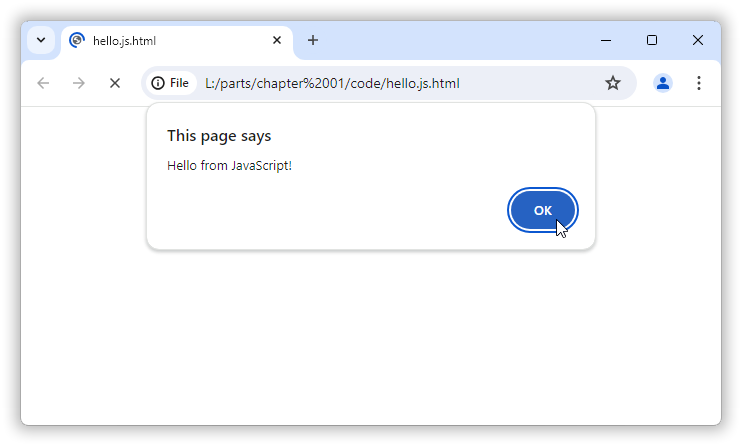

## Chapter 2: &nbsp;First steps.

<!-- START doctoc generated TOC please keep comment here to allow auto update -->
<!-- DON'T EDIT THIS SECTION, INSTEAD RE-RUN doctoc TO UPDATE -->
<!-- **Table of Contents**  *generated with [DocToc](https://github.com/thlorenz/doctoc)* -->

- [2.1 &nbsp;“Hello, world!”.](#21-hello-world)
  - [2.1.1 &nbsp;Launch Notepad.](#211-launch-notepad)
  - [2.1.2 &nbsp;Type or paste in the source code &mdash; correctly!](#212-type-or-paste-in-the-source-code--correctly)
  - [2.1.3 &nbsp;Save the text to a file.](#213-save-the-text-to-a-file)
  - [2.1.4 &nbsp;Find the file.](#214-find-the-file)
  - [2.1.5 &nbsp;Feed the file to your browser.](#215-feed-the-file-to-your-browser)
- [2.2 &nbsp;Static HTML + event &rarr; dynamic JavaScript execution.](#22-static-html--event--dynamic-javascript-execution)
- [2.3 &nbsp;JavaScript execution &rarr; changes to the page presentation.](#23-javascript-execution--changes-to-the-page-presentation)
- [2.4 &nbsp;Functions.](#24-functions)

<!-- END doctoc generated TOC please keep comment here to allow auto update -->

<!-- 22-static-html--event--dynamic-javascript-execution -->

---

The only good way to learn programming is by **doing**: trying out stuff, investigating, exploring, experimenting, making sure that one actually can do the things. And just implementing one’s own ideas, maybe wild ideas. I like that last part best.

Here at the start you get detailed guidance on how to *do* things. We’ll start by trying out the JavaScript hello-example from the first chapter, even if you’ve already done that on your own. Some variations follow.

But later on there will be progressively less and then no detailed how-to guidance for the *do*-ing. You are then expected to figure out things, because the most important and effective tool you have is **you**, your brain. And that includes both sides of that brain: both the right brain’s sense of aesthetic beauty, e.g. designing the perfect user interface, and the left brain’s analytical part that figures out how to make that design work so that it’s not just pretty cosmetics but actually a super-useful thing.

For example, at some point you may wonder, where to click or what to write in a command? That’s for you. You will **look** at what’s available to you and recognize it and just apply what you’ve already learned and use resources such as command help-texts, documentation (on the net and local), plain googling,

<table width="100%" border="0">
<tr>
<td width="180"></td>
<td valign="top">

&larr; asking people in programming  forums, and

<p>&nbsp;</p>

in some cases you’ll obstinately do hard
detective work into the very late hours&hellip; &rarr;
</td>
<td width="180"></td>
</tr>
</table>

<table width="100%" border="0"><td>


Good googling skills are important for programming. You will need to be able to sort out the wheat from the chaff in the search results. Because while artificial intelligence can help and does have a lot of knowledge, as of 2024 it still lacks common sense. And so there will be a lot of irrelevant results and a lot of low quality results, for you to sort out. You will need to be able to mostly ignore the irrelevant and the low quality, at a glance, and possibly follow vague clues for several levels of links, and dive right into the good helpful links. This ability comes with experience. By doing this many times.
</td></table>

### 2.1 &nbsp;“Hello, world!”.

In the first chapter you saw how JavaScript code can be “packaged” within HTML that can be fed to a web browser, to produce a result like this (here with Google’s Chrome browser):



The source code that produced this, the JavaScript “packaged” within HTML:

[*hello.js.html*](code/hello.js.html)

```html
<script>
    alert( 'Hello from JavaScript!' );
</script>
```

And I mentioned that to write such source code you *can* use almost any text editor including Windows’ own Notepad.

In Windows 11 Notepad it looks like


---

Shortly you will need a better source code editor, a programmer’s editor like Notepad++ or Visual Code.


For example, Notepad doesn’t help you with indenting and it doesn’t color parts of the source code according to purpose, and in earlier versions it has even tried to foul up the user’s work by adding a “.txt” filename extension after the “.html” (or whatever) that one specified. No doubt whoever programmed it had good intentions, a desire to help out the user; surely the user wants “.txt”! But it’s unfortunately help of the kind where you’re sleeping peacefully under a tree and a helpful friendly bear decides to swat a fly that lands on your nose&hellip;

However, partially in order to avoid installing anything new we’ll use Notepad in this chapter. Well, you can of course use any other editor &mdash; except, *don’t* use Microsoft Word or Windows WordPad because they don’t save pure text by default; they are not text editor programs. And if you already have some other favorite editor then you may recognize that you master what some or all of these examples are about, and if so then you may of course just skip ahead.

---

In the classic 1978 book “[The C Programming Language](https://en.wikipedia.org/wiki/The_C_Programming_Language)” the authors Kernighan & Ritchie, the K&R in “K&R C”, sidestepped the practical tool usage challenges by saying “check with a local expert”, and a book exclusively for students at teaching institutions usually doesn’t even say that explicitly, but just tacitly assumes that teaching assistants will fill the rôle of “local expert”.

I instead assume that you &mdash; or some reader &mdash; (1) is learning on your own; (2) is starting from scratch so that in the beginning much guidance is needed; and (3) *has no local expert to consult*.


#### 2.1.1 &nbsp;Launch Notepad.

Terminology: **launch**, **run**, **execute**, these all mean the same thing. One may even say **start**. Or **fire up**.

So, how does one then launch / run / execute / start / fire up Notepad, and what are the important rules (not to be broken) about the source code text, and where should the file be saved, and how, and how is it fed to a web browser?

The probably simplest general way to launch Notepad in Windows 11:

1.  Click in the *Search* field in the task bar.  
    Windows responds by presenting a text cursor there and by popping up a Start menu e.g. filled with a mix of some useful things and mostly sheer nonsense.  
    

2.  Type `n` for <u>N</u>otepad.  
    Since Notepad is a very common standard Windows program it makes the top of the search results list.  
    

3.  Click the “Notepad” item on the left or the “Open” item on the right.  
    A Notepad window appears, with a blinking text cursor `|` where you can type.  
    

The Windows Start menu may not look exactly like that on your PC. For example, if you have used it for some time the menu will probably be populated with recently used items instead of the mentioned and shown mix. And for example, the shown “Node.js” search result is a JavaScript execution environment that I use to run the `doctoc` console program that generates the tables of contents in this book, and that you probably don’t (yet) have installed on your computer.


#### 2.1.2 &nbsp;Type or paste in the source code &mdash; correctly!

You can now just type or paste in the program instructions text a.k.a. source code,

[*hello.js.html*](code/hello.js.html)

```html
<script>
    alert( 'Hello from JavaScript!' );
</script>
```

If you type it in &mdash; and most code is typed in by programmers &mdash; you need to get the following correct:

* `alert` must be written in all lowercase, and not as e.g. `Alert` or `ALERT`. Case matters for JavaScript, and for C# and C++. We say that these languages are **case-sensitive** languages.
* The apostrophes **`'`** must be single **straight apostrophes**, a.k.a. single quotes, character number 39 in the ASCII character set. Or,  both can alternatively be double quotes, the double quote character `"` which is ASCII character number 34. JavaScript itself supports both ways of delimiting the text to display, both `'hello'` and `"hello"`. But for JavaScript in HTML one generally uses only single quotes like `'hello'` because *the double quote characters are used for including JavaScript code in HTML double quotes*, to have that JavaScript code executed when certain events such as mouse clicks occur. For example,
  ```html
  <button onclick="alert('Button clicked!');">Click me!</button>
  ```
  &hellip; where all the text till and including the first `"` is HTML, the following text up till the second `"` is JavaScript (if it contained an unprotected double quote character that would end the JavaScript part right there!), and the rest is HTML again.
* The **semicolon** `;` serves to end an instruction, it tells the interpreter that here’s the end of this instruction, but it can be omitted. JavaScript is very lenient about semicolons, almost as if it had common sense. However, C# and C++ are very strict about it, so it’s a good habit, a *best practice*, to always terminate an instruction with a semicolon unless it’s a curly braces block.


#### 2.1.3 &nbsp;Save the text to a file.

After typing or pasting in the source code Notepad can now look like:


In programming forums for learners there is a slow but steady trickle of questions about why oh why doesn’t some obviously correct code work. When the answer often is that they’ve just ***forgotten to save*** in the editor. Before saving the text changes only exist in the computer’s fast but sort of short term working memory, **RAM**, and/or (the case for modern Notepad) in a practically inaccessible temporary file. Saving it copies the text to more persistent storage, for historical reasons called **disk**, where it can be accessed via its **file name**, which is where a compiler or interpreter fetches file contents from. So, when the learner forgot to save, the interpreter or compiler saw just an empty file or perhaps a file with old contents instead of the shiny new code&hellip;

Relevant: where you earlier saw a little cross `×` to close the tab there’s now a little gray disk `•` symbol, at the pointy end of the big orange arrow that I placed in the image. That subtle indication means that the text changes so far only exist in RAM and/or temporary storage, that the new text has not been saved to the named disk file. When you save it the gray disk symbol turns back into a close-it cross `×`.

Other editors have other ways of indicating “unsaved changes”. For example, which is a common scheme, Notepad++ places an `*` asterisk in front of the filename/path in the window title. But VS Code uses the same scheme as Notepad, perhaps because they’re both Microsoft software.

---

Notepad’s menu item *File*▸*Save* saves the file. If this is a new file then you’re asked where to save it. Here at the very start of the book it doesn’t really matter where you save it as long as it’s a place where Windows allows you to save.

***You don’t have to do that yet***, but do look at the menu:


The menu item tells you that instead of mousing to *File*▸*Save* you could have used keypress `Ctrl`+`S`.

That is, hold down a/the `Ctrl` key and while it’s depressed press & release the `S` key. This is variously called a *keyboard shortcut*, an *accelerator key*, or a *hot key*. Sometimes people (not to mention Microsoft) put finer distinctions on what is what, in particular that a “hot key” works the same in all of Windows, but when that’s relevant it takes far less effort to just describe the intended meaning than to teach the other person(s) about the subtle details of the One True Terminology&trade;, so I just say “shortcut” as a general term.

---

When you press `Ctrl`+`S` or click on the *File*▸*Save* item Notepad pops up a **“Save as”-dialog** where you can choose where to save the file, its name, and even its encoding (but you can just leave that as UTF-8):


For now it doesn’t matter where you save the file. But you need to change the filename from the automatically generated “script” or “script.txt” (both of these save as “script.txt”) to e.g. “hello.js.html”, or anyway a name with **filename extension** “.html”. Otherwise only some ways to feed it to the browser will work, and with a “.txt” filename extension the browser will just present the the file’s text instead of what that text means as HTML and JavaScript.

So,


After saving the file you get the full filename in Notepad’s title bar, even when Windows Explorer’s option “Hide filename extensions for known filetypes” is enabled. And the subtle “unsaved changes” disk symbol `•` is replaced with a close-it cross `×`. You now have a source code file called “hello.js.html” if you chose that name:


It’s saved, yay!


#### 2.1.4 &nbsp;Find the file.

To open the saved file in a browser &mdash; to “feed” it to the browser &mdash; you now first have to find it.

With a real programmer’s editor such as Notepad++ you would have available some menu item to open a  **File Explorer** a.k.a. Windows Explorer view of the file’s folder. Alas, Notepad doesn’t provide that. However, chances are that you saved it in your **user folder**, which you can get to by opening a File Explorer instance and typing in its address bar, literally, `%userprofile%`, and pressing the enter/return key.

* ***Note:*** *Windows 11 File Explorer  “Home” = the earlier  “Quick Access” thing rebranded!*  
    In Linux and on the Mac the user folder, the folder where a user can store his or her private files, is called the user’s **home folder**, and this was so also in Windows prior to Windows 11. But Windows 11’s File Explorer renamed “Quick Access” to “Home”, i.e. they co-opted and shanghaied the “Home” term. So if you go to “Home” in File Explorer &mdash; it’s very prominently on top in the navigation bar &mdash; you don’t get to your user folder but to something File Explorer calls “Home” that is the earlier Windows versions’ “Quick Access”&hellip;

This means that just clicking on  “Home” in the Windows 11 File Explorer won’t give you a view of the files in your user folder; it shows just the Quick Access stuff.

If you can’t find a view of the user folder where you can see the file, or if the file is some other place, then you can just eliminate this mosquito problem with an intercontinental H-bomb missile, namely by using Windows’ general search &mdash; the same way we started Notepad. Only this time don’t type “n” for <u>N</u>otepad. Just  type enough of the filename that Windows finds it, e.g. “hello.j”:


When you now click “Open file location” you get a File Explorer view of the folder where the file is, with the file selected:


In this screenshot the “.html” filename extension appears to be missing, but that’s just because the File Explorer option “Hide filename extensions for known filetypes” is enabled. I prefer to turn that off, to see filename extensions, both to have better control and because in some cases several files have the same name but different filename extensions. Then it’s ungood when the extensions are hidden.

Another detail: the file icon is Google Chrome’s because this user has installed Google Chrome and set it as his default browser.


#### 2.1.5 &nbsp;Feed the file to your browser.

When you double click the file it’s opened in / launched in / fed to &hellip;, the default browser:


Third detail: the address that the browser presents is not exactly like an ordinary Windows *path* to a file. We’ll explore the structure and geography of the filesystem, the space where files are stored, later. Suffice it to say for now that the browser tries to show that the file is stored at (Windows path) “C:\Users\Bjørn Håkon Sæther\hello.js.html”, which means disk drive “c:”, on that disk the folder “\users\bjørn håkon sæther”, and in that folder the filename “hello.js.html”, but the browser replaces each backslash `\` with a forward slash `/` and each space with `%20`.

Even Microsoft’s own Edge browser does this, conforming to the rules for browsing addresses, which are different than the rules for Windows filesystem paths.


### 2.2 &nbsp;Static HTML + event &rarr; dynamic JavaScript execution.

The difference between static HTML content and dynamic JavaScript actions is better observed with an example where the message box only pops up after the page content has been presented, e.g. when the user clicks a button.

**Events** involving an HTML button, such as the event “the button was clicked”, can be *connected* to JavaScript by writing e.g. `onclick=`&hellip;, with the JavaScript code enclosed in HTML double quote characters.

It is for this reason that by strong convention single quote characters are used in the JavaScript code itself:

[*hello-from-button.js.html*](code/hello-from-button.js.html):

```html
This is the “Hello from a button!” program.
<button onclick="alert( 'Hello from a button!' );">Click me!</button>
```

Example run:

<center>
<br>
↓<br>
<br>
↓<br>
<br>
</center>

You can of course click the button how many times you want, not just one time. Each time the JavaScript code is executed. Which causes the message box to pop up again.

In passing: the button’s total grayness, its lack of color, is not style badness all the way down at the default Windows message box level, but it doesn’t feel entirely right either. Coloring and visible reactions (feedback) to mouse-over and clicking can be added via a third language called **CSS**. This is the triad of main formal languages used in client side web development: HTML for contents, CSS for styling, and JavaScript for actions (of these JavaScript is the only programming language).

Terminology: the JavaScript code that is connected to an event and executed when the event happens, is called an **event handler**. But often this code is very short, just specifying that a named chunk of code (a “function”), that is defined somewhere else, should be executed. Then also that named chunk is called an event handler; it handles the event.


### 2.3 &nbsp;JavaScript execution &rarr; changes to the page presentation.

In addition to being connected to events JavaScript code can inspect and change the browser’s representation of the page it presents.

For example, in a click event handler for a button the JavaScript keyword [**`this`**](https://developer.mozilla.org/en-US/docs/Web/JavaScript/Reference/Operators/this) refers to the browser’s representation of the button. That representation is an example of an **object**. The browser’s representation of the page it presents is a collection of such objects that refer to each other (mostly in a hierarchy), called the **DOM**, the *<u>D</u>ocument <u>O</u>bject <u>M</u>odel*.

That is, what the browser presents isn’t directly the HTML. The browser builds the DOM object collection from the HTML specification because the DOM supports much faster presentation and is much easier to change, than the HTML text. After the DOM has been built the browser can present it all or parts of it again and again, as needed, very fast compared to analyzing and presenting the HTML directly:

&nbsp;&nbsp;&nbsp;&nbsp;&nbsp;&nbsp;&nbsp;&nbsp;HTML &rarr; DOM &rarr; presentation

To access a part of an object you can write *object* **`.`** *part* where *part* is the name of the part. For example, in a button’s click event handler you can write `this.innerText` to access the text in the button. This is sometimes called [**dot notation**](https://en.wikipedia.org/wiki/JavaScript#Object-orientation_(prototype-based)).

So, you *could* present the button’s text in a message box by writing `alert( this.innerText )`, but more usefully: you can *change* that text by writing e.g. `this.innerText = 'Has been clicked'`. Or whatever new text you want. Here the symbol **`=`** denotes a *change of value*, that the value on the right of `=` shall be the new value of the value holder thing on the left, i.e replacing its old value, which is called an [**assignment**](https://en.wikipedia.org/wiki/Assignment_(computer_science)).

* It’s common for students to incorrectly assume the `=` symbol’s mathematical meaning of equality, where the two things that are equated continue to be equal forever. But for example, that is not the meaning of `=` on a calculator, where it says “compute this now!”. And it’s not the meaning in programming languages with C notation, like JavaScript, C# and C++, where it says “***replace*** that value now!” (assignment).


We can for example use this DOM changing capability  &mdash; combining `this`, and dot-notation for object part access, and `=` assignment to replace values &mdash; in a program where you can click a button just once.

When the button is clicked the JavaScript click event handler changes the text, and *disables* the button by assigning the special value `true` to its `.disabled` part (much more about this later, including more specific terminology &mdash; not yet needed):

[*single-click-button.js.html*](code/single-click-button.js.html):
```html
This is the “Single click button!” program.
<button onclick="this.innerText = 'Has been clicked.'; this.disabled = true;">
    Click this button!
</button>
```

Example run:

<center>
<br>
↓<br>
<br>
</center>

This ability to change the DOM, and hence the presentation, is the basis of e.g. animations and graphics from JavaScript in a browser.


### 2.4 &nbsp;Functions.

In JavaScript, C# and C++ a named chunk of code is called a **function**.

One way to define a function &mdash; and yes, this is about *defining new instructions*, as was mentioned in the first chapter &mdash; is to use the JavaScript keyword **`function`**, e.g. like

```javascript
function handleButtonClick()
{
    alert( 'Hello from a button!' );
}
```

The round parenthesis is a place to define names of **parameters**. The above function defines no parameter names. It could have defined e.g. `eventInfo`, like `function handleButtonClick( eventInfo )`, because when this function is executed as an event handler it receives such a parameter. By not declaring a name for that parameter it’s just ignored. In C# or C++ one has to do extra things in order to deal with parameters that one doesn’t use, but in JavaScript they can just be safely ignored, entirely ignored.

The curly braces **`{`** and **`}`** enclose the **function body**, the code that this function definition names. Both JavaScript, C# and C++ require curly braces around function bodies. They inherited this notation from the old C language.

---

In JavaScript it’s also entirely OK that a function is used before it’s defined.

So, using and defining a function can go like this:

[*hello-from-button-v2.js.html*](code/hello-from-button-v2.js.html):

```html
This is the “Hello from a button!” program version 2.
<button onclick="handleButtonClick();">Click me!</button>
<script>
    function handleButtonClick()
    {
        alert( 'Hello from a button!' );
    }
</script>
```

Here the round parenthesis in `onclick="handleButtonClick();"` says that this function should be executed. This is an example of **calling** the function. Without the parenthesis one would just be referring to the function and nothing would happen (you can try that!).

Example run, just the initial page display and effect of clicking the button:

<center>
<br>
↓<br>
<br>
</center>


Note: the **name** of a function or whatever can not start with a digit and it cannot contain spaces or e.g. quote characters. A good general rule is to use only the English letters `a` through `z`, the digits `0` through `9` and possibly underscores `_` as word separators. But the general convention in JavaScript is to instead indicate the start of a word in a name, by using uppercase for the first letter of the word. 


